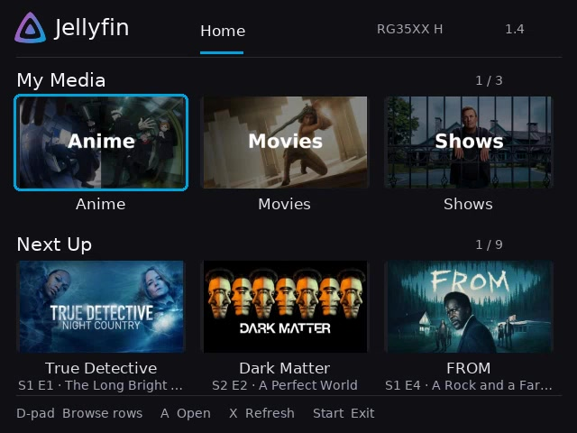

# Jellyfin RG35XX H

Watch your Jellyfin library on an Anbernic RG35XX H running KNULLI. This is an unofficial, controller-first app built for the handheld's 640×480 screen.

**Tested on the latest KNULLI Scarab release.**

It has a Jellyfin-style home screen with **My Media**, **Next Up**, **Continue Watching**, and **Recently Added** shelves. Folder artwork and media thumbnails load from your own server. Watched titles display a check badge and partially watched titles show their progress bar.

## See it in action

This frame comes directly from the recorded RG35XX H demo, with artwork loaded from Jellyfin. Select it to play the full video in your browser.

[](https://github.com/aG00Dtime/jellyfin-rg35xxh/raw/refs/heads/master/docs/screenshots/navigation-demo.mp4)

[Watch the controller navigation demo (MP4, 6 MB)](https://github.com/aG00Dtime/jellyfin-rg35xxh/raw/refs/heads/master/docs/screenshots/navigation-demo.mp4)

## What you need

- An **Anbernic RG35XX H** with **KNULLI** installed.
- **PortMaster** installed on KNULLI. In KNULLI, press **Start** → **Device Settings** → **Install PortMaster** if you do not already have it. [KNULLI's PortMaster guide](https://knulli.org/systems/portmaster/) explains the standard setup.
- A Jellyfin server you can already sign into.
- Wi-Fi on the handheld. Streaming and artwork both come from your server.

## Install — no terminal needed

1. Download `jellyfinrg35xx.zip` from this project's latest release.
2. Extract the ZIP on your computer. You will get a file named `Jellyfin RG35XX.sh` and a folder named `jellyfinrg35xx`.
3. Open the KNULLI data card, then open `roms/ports`.
4. Copy both the file and the folder into `roms/ports`.
5. Put the card back in the handheld. In KNULLI, open **Ports** and launch **Jellyfin RG35XX**.
6. On first launch, enter your server URL, username, and password with the controller keyboard. A bare domain is automatically treated as HTTPS; explicit `http://` and `https://` URLs are respected.

For a later update, copy the new file and folder into the same place and allow your computer to merge the folder. Do **not** delete `config.json`; release packages deliberately do not contain it.

## Controls

| Where you are | Controls |
| --- | --- |
| Home and folders | D-pad moves, **A** opens, **B** goes back, **R1** opens Settings, **Start** exits |
| Settings | Change quality, edit connection details, or choose Logout; Logout asks for confirmation and keeps the server and username |
| Login keyboard | D-pad chooses, **A** types, **R1** toggles caps/symbols, **X** inserts a space, **Y** deletes, **Start** saves the field, **B** cancels |
| Video | **A** pauses or resumes; **B**, **Start**, or **Select** returns to the app |
| Video seeking | D-pad left/right skips 10 seconds; L1/R1 skips 30 seconds; L2/R2 skips 60 seconds |
| Audio and subtitles | **X** cycles audio tracks; **Y** cycles subtitle tracks (including Off) |
| Volume | The handheld's volume buttons still control KNULLI volume |

The app reports playback to Jellyfin while you watch and when you stop, so **Continue Watching** and resume position stay in sync.

Jellyfin temporarily pauses KNULLI's automatic idle sleep while the app is open, then restores it when you exit.

## Early-release note

This is a community project and it is still evolving. It has been tested on an RG35XX H running KNULLI Scarab, but some media formats, server configurations, artwork, or controller situations may still reveal bugs. If something behaves oddly, restart the app first and then [open an issue](https://github.com/aG00Dtime/jellyfin-rg35xxh/issues) with the Jellyfin version, KNULLI version, and a short description of what happened. Never include your server address, username, password, or access token.

## If something goes wrong

- **No connection:** confirm the handheld is on Wi-Fi and that the server URL is correct. A bare domain uses HTTPS by default.
- **Login failed:** open Settings and re-enter the password.
- **Video is choppy:** open Settings and choose `360p` or `480p`. The RG35XX H is happiest with a modest H.264/AAC stream.
- **No artwork yet:** give the home screen a moment. Images download in the background and are cached on the SD card.
- **A new release does not appear:** exit back to the KNULLI menu and launch it again.

## Keep your account private

The app encrypts the saved connection data on the handheld using a device-local AES key. The key and encrypted config are excluded from Git and release ZIPs. This protects the SD-card files if copied, but cannot protect credentials from someone with root access to the running device.

## License and attribution

This project is licensed under the [MIT License](LICENSE). If you copy, modify,
or redistribute the software, you must retain the copyright and license notice
included in `LICENSE`.

The project is unofficial and is not affiliated with Jellyfin or KNULLI. The
Jellyfin icon and DejaVu Sans font are third-party assets with their own notices
and licensing requirements; see the attribution notes below and the files in
`app/assets/`.

The app is Python and pygame. On Windows, run:

```powershell
.\package.ps1
```

This creates `jellyfinrg35xx.zip`. Automated checks are in `tests/`; the device-specific verification notes are in [tests/VERIFICATION-1.3.md](tests/VERIFICATION-1.3.md).

The Jellyfin icon is from [Jellyfin UX](https://github.com/jellyfin/jellyfin-ux), used under Jellyfin's [branding guidance](https://jellyfin.org/docs/project/branding/). The bundled DejaVu Sans font includes its required license in [app/assets/DejaVuSans-LICENSE.txt](app/assets/DejaVuSans-LICENSE.txt).
